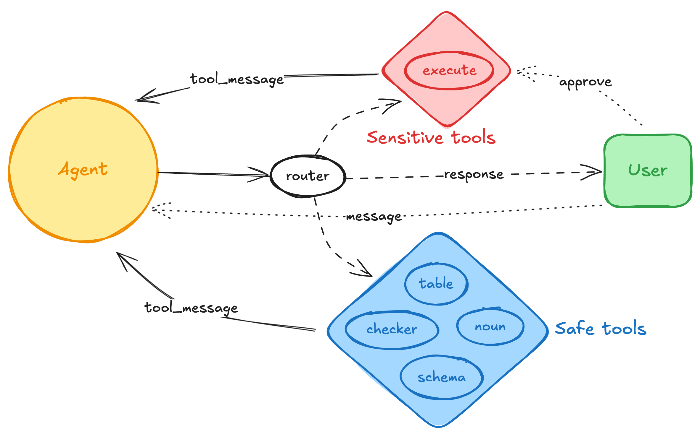

**This repository gathers some technical articles and techniques about Generative AI including  image generation, LLM, NLP, MLOps, .etc.**

## LLM
### [9 Methods to Enhance the Performance of a LLM RAG Application](llm/rag/README.md)

### [Road to Lakehouse - Part 3: Data Analytics with Generative AI](spark_ai/README.md)

