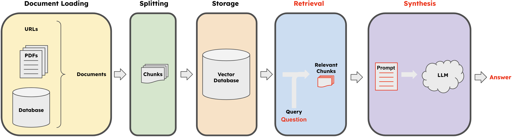
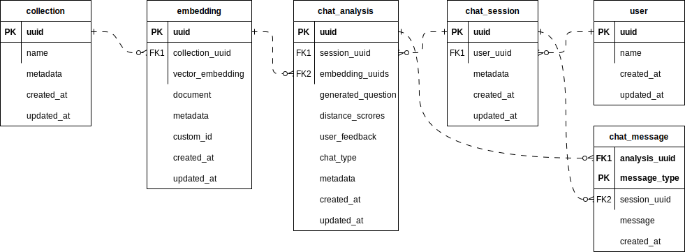
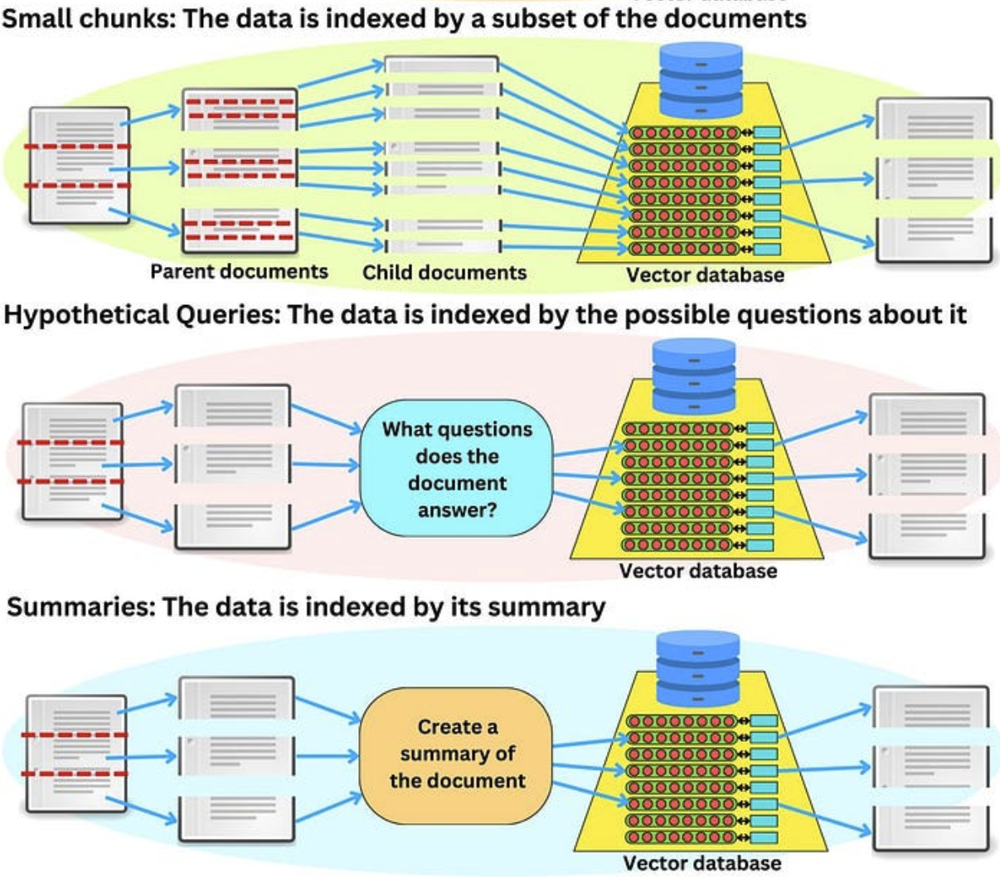
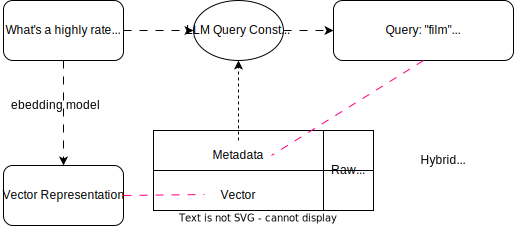
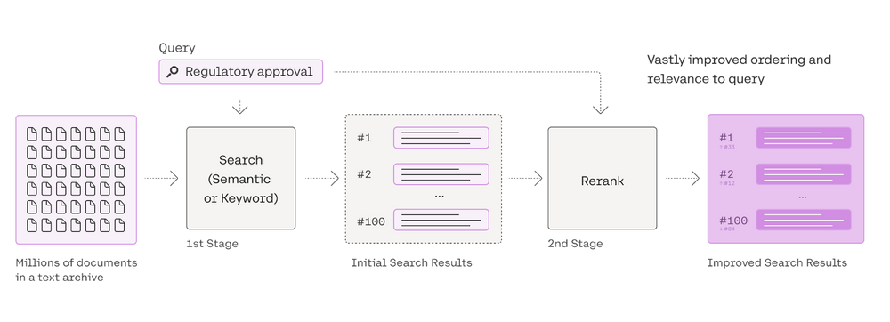
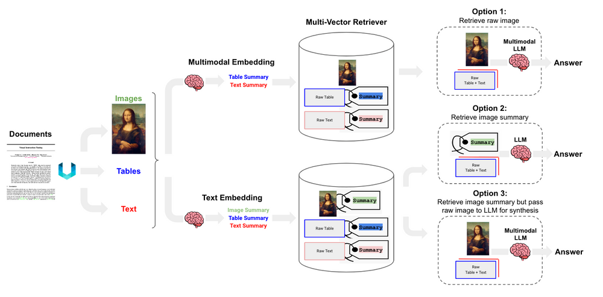
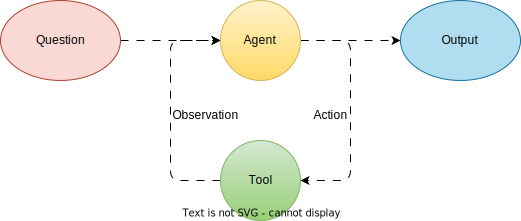
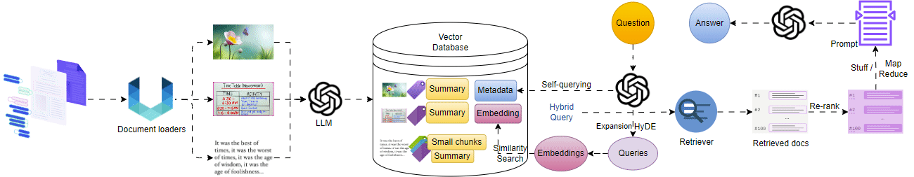

# 9 Methods to Enhance the Performance of a LLM RAG Application

It is easy to prototype your first LLM RAG (Retrieval Augmented Generation) application, e.g. using this [chat-langchain][chat-langchain] template with below architecture.


But it is hard to make it work well. In this article, I gather and share some approaches to enhance the performance of the LLM RAG application.

For more details, please refer to references I mention in each section.

## 1. Store message histories and user feedbacks
Chat histories and user feedbacks are important for the application analytics. We will use them later in a next session.


In an above schema, 1 collection should have multiple embeddings. 1 user can have many chat sessions, and in each chat session, we store the messages (between human and AI) and their analytical information such as generated questions (condense questions or questions after query transformations), retrieved chunks and corresponding distance scores, user feedback, .etc.  

## 2. Start evaluating your application
A naive RAG app can have some challenges, e.g.: bad retrieval (low precision, low recall, outdated information), bad response generation (hallucination, irrelevance, toxicity/bias), .etc

Before improving it, we need a way to measure its performance. We can use the following [ragas][ragas] metrics for the evaluation.


Because some scores need `ground_truth`, there are 2 ways to create the labeled evaluation dataset:
- Human-annotated labeled dataset: we can use some real questions and answers that users give good feedback from the first method `chat_analysis` table.
- Generated labeled dataset (good for cold start):
  - Prompt GPT-4 Turbo to generate questions from each chunk or multiple chunks to get pairs of question & doc chunks.
  - Run above pairs of question & context through GPT-4 Turbo to generate answer.

Eventually we can run through this labeled dataset with above pre-defined metrics and use GPT-4 Turbo as an evaluator/judge.

For a better observation, we should also use some LLMOps platforms such as [LangSmith][LangSmith], [MLflow][MLflow] or integrate [DeepEval][DeepEval] in CI/CD pipelines.

## 3. [Multi-vector retriever](https://python.langchain.com/docs/modules/data_connection/retrievers/multi_vector)
When splitting documents for retrieval, there are often conflicting desires:
- We may want to have small chunks, so that their embeddings can most accurately reflect their meaning. If too long, then the embeddings can lose meaning.
- We also want to have long enough documents that the contexts are retained. Separating the document many times by `separators` and `chunk_size` sometimes breaks the context unexpectedly. It's also hard to combine the chunks in a right order to form the meaningful document for a prompt context. 

Below approaches allow us to balance precise embeddings and context retention by splitting documents into smaller chunks for embedding but retrieving larger text information or even the whole original document for the prompt context, since many LLM models nowadays support long context window, e.g. GPT-4 Turbo supports 128,000 tokens.

|  |
|:----------------------------------------------------------------------| 
| *Image by TheAiEdge.io*                                               |

- [Parent Document Retriever](https://python.langchain.com/docs/modules/data_connection/retrievers/parent_document_retriever):
  - Instead of indexing entire documents, data is divided into smaller chunks, referred to as Parent and Child documents.
  - Child documents are indexed for better representation of specific concepts, while parent documents are retrieved to ensure context retention.
  - Sometimes, the full documents can be too big to retrieve them as is. In that case, first split the raw documents into larger chunks, and then split them into smaller chunks. We then index the smaller chunks, but on retrieval we retrieve the larger chunks (but still not the full documents).
- Hypothetical Questions:
  - Documents are processed to generate potential questions they might answer. 
  - These questions are then indexed for better representation of specific concepts, while parent documents are retrieved to ensure context retention.
- Summaries:
  - Instead of indexing the entire document, a summary of the document is created and indexed. 
  - Similarly, the parent document is retrieved in the application.

## 4. Query transformations
Because the original query can not be always optimal to retrieve for the LLM, especially in the real world. The user often doesn't provide the full context and thinks about the question from a specific angle.

Query transformation deals with transformations of the user's question before passing to the embedding model. Below are a few variations of query transform methods and their sample prompt implementation. They are all using an LLM to generate a new or multiple new queries.

1. [Rewrite-Retrieve-Read](https://github.com/langchain-ai/langchain/blob/master/cookbook/rewrite.ipynb)
2. [Hypothetical Document Embeddings (HyDE)](https://python.langchain.com/docs/templates/hyde)
3. [Follow-up question to condensed/standalone one](https://smith.langchain.com/hub/langchain-ai/weblangchain-search-query)
4. [RAG Fusion](https://github.com/langchain-ai/langchain/blob/master/cookbook/rag_fusion.ipynb)
5. [Step-Back Prompting](https://github.com/langchain-ai/langchain/blob/master/cookbook/stepback-qa.ipynb)
6. [Multi Query Retrieval / Expansion](https://python.langchain.com/docs/modules/data_connection/retrievers/MultiQueryRetriever)

We can also combine multiple query transformation techniques to get the best result e.g.


## 5. Retrieval optimization
### [Self-querying](https://python.langchain.com/docs/modules/data_connection/retrievers/self_query)
Do you remember a `metadata` column in an above `embedding` table?  We can include additional information such as author, genre, rating, the date it was written, …, and any information about the document beyond the text itself.  We can define a schema and store the metadata in a structured way alongside the vector representation.

With the database metadata schema, we use LLM to construct a structured query from the question to filter the document chunks. At the same time, the question is also converted into its vector representation for the similarity search. This kind of hybrid retrieval approaches are likely to become more and more common when RAG becomes a more widely adopted strategy.


### [Time-weighted retriever](https://python.langchain.com/docs/modules/data_connection/retrievers/time_weighted_vectorstore)
In some cases, the information contained in the documents is only relevant if it is recent enough. In the context of a time-weighted retriever, the data is retrieved based on the hybrid score between semantic similarity and the age of the document.
The algorithm for scoring it can be:
```
semantic_similarity + (1.0 - decay_rate) ^ hours_passed
```

## 6. Document selection optimization
### [Re-ranking](https://python.langchain.com/docs/integrations/retrievers/cohere-reranker)
After first-stage retrieval (lexical/keyword-based search or semantic/embedding-based search), doing re-ranking as a second stage to rank retrieved documents using relevance scores.

|            |
|:----------------------------------------------| 
| *Image by Cohere.com*                         |

### [Maximal Marginal Relevance (MMR)](https://python.langchain.com/docs/modules/model_io/prompts/example_selectors/mmr)
Sometimes we retrieve more than we actually need, there can be similar documents capturing the same information. The MMR metric penalizes redundant information.

The reranking is an iterative process where we measure the similarity of the vectors to the query and the similarity of the vectors to the vectors we have already re-ranked, end up with a vector similar to the query but dissimilar to the vectors we already reranked.

## 7. [Context Optimization](https://python.langchain.com/docs/use_cases/summarization)
Now that we have selected the correct documents to answer the question, we need to figure out how we will pass data as context for the LLM to answer the question.

- [Stuffing](https://python.langchain.com/docs/modules/chains/document/stuff) is the simplest method to pass data to the language model. It concatenates the text of those documents and pass it to the prompt.
- [MapReduce](https://python.langchain.com/docs/modules/chains/document/map_reduce) implements a multi-stage summarization. It is a technique for summarizing large pieces of text by first summarizing smaller chunks of text and then combining those summaries into a single summary. Instead of summarization, we can also iterate through the documents to extract the information likely to answer the question.
- [Refine](https://python.langchain.com/docs/modules/chains/document/refine) method is an alternative method to deal with large document summarization. It works by first running an initial prompt on a small chunk of data, generating some output. Then, for each subsequent document, the output from the previous document is passed in along with the new document, and the LLM is asked to refine the output based on the new document.
- [Map-rerank](https://python.langchain.com/docs/modules/chains/document/map_rerank) strategy iterates through each document and tries to answer the question along with a score on how well the question was answered. We can then pick the answer with the highest score.

|               | stuff                                                         | map_reduce                                                  | refine                                                      | map_rerank                                                  |
|---------------|---------------------------------------------------------------|-------------------------------------------------------------|-------------------------------------------------------------|-------------------------------------------------------------|
| **Pros**      | Only makes a single call to the LLM. When generating text, the LLM has access to all the data at once. | This can scale to larger documents (and more documents) than StuffDocumentsChain. The calls to the LLM on individual documents are independent and can therefore be parallelized. | Can pull in the more relevant context, and may be less lossy than MapReduceDocumentsChain. | The map re-rank documents chain runs an initial prompt on each document, that not only tries to complete a task but also gives a score for how certain it is in its answer. The highest scoring response is returned. |
| **Cons**      | Most LLMs have a context length, and for large documents (or many documents) this will not work as it will result in a prompt larger than the context length. | Requires many more calls to the LLM than StuffDocumentsChain. Loses some information during the final combining call. Higher cost incurred in both map and reduce than stuff | Requires many more calls to the LLM than StuffDocumentsChain. The calls are also NOT independent, meaning they cannot be paralleled like MapReduceDocumentsChain. There are also some potential dependencies on the ordering of the documents. | This method assumes that only one of the documents contains the answer, so it tends to be less accurate. |


## 8. [Multimodal RAG](https://blog.langchain.dev/semi-structured-multi-modal-rag)
When dealing with semi-structured or unstructured data e.g. tables, text, and images, we might need multimodal LLM and/or multimodal embeddings, below are some options:

1. Use multimodal embeddings (such as CLIP) to embed images and text together. Retrieve either using similarity search, but simply link to images in a docstore. Pass raw images and text chunks to a multimodal LLM for synthesis.
2. Use a multimodal LLM (such as GPT4-V, LLaVA, or FUYU-8b) to produce text summaries from images. Embed and retrieve text summaries using a text embedding model. And, again, reference raw text chunks or tables from a docstore for answer synthesis by the LLM 
   1. Exclude image from the docstore, instead pass image text summary to LLM 
   2. Use a multi-modal LLM for synthesis, with raw image and raw table, text

## 9. [Agents](https://python.langchain.com/docs/modules/agents)
Last but not least, you may not only build the RAG app to answer questions from documents, we can have multiple tools to augment the LLM app. An agent uses the LLM to choose a sequence of actions to take to solve a problem.



The Agent can consist of some key components:
- The Agent Core: This is the central component of the agent responsible for making decisions. It is powered by the LLM and a prompt that includes the agent's personality, background context, and prompting strategies.
- Tools and Toolkits: Tools are functionalities that the agent can access and utilize to perform specific tasks. Toolkits are collections of related tools that work together to accomplish specific objectives. There are two important design considerations around tools:
  - Giving the agent access to the right tools 
  - Describing the tools in a way that is most helpful to the agent

There are some types of agents we should first start with:
- [ReAct](https://python.langchain.com/docs/modules/agents/agent_types/react)
- [OpenAI functions](https://python.langchain.com/docs/modules/agents/agent_types/openai_functions_agent)
- [OpenAI assistants](https://python.langchain.com/docs/modules/agents/agent_types/openai_assistants)

## Conclusion
I suggest to read all above methods, and then pick the ones that are most relevant to your use case. You can also combine multiple approaches to get the best result. For example, the first architecture can be turned to a below one

If you find this article useful, please give it a star/like/clap and share it with your friends. Thanks for reading!


<!-- links -->

[chat-langchain]: https://github.com/langchain-ai/chat-langchain
[ragas]: https://github.com/explodinggradients/ragas
[LangSmith]: https://smith.langchain.com
[MLflow]: https://github.com/mlflow/mlflow
[DeepEval]: https://github.com/confident-ai/deepeval
