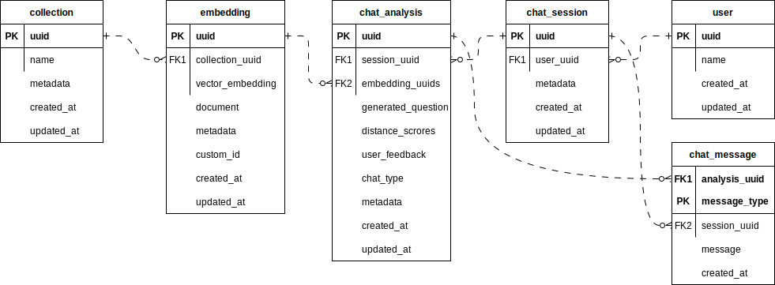

# 7 Methods to Enhance the Performance of a LLM RAG (Retrieval Augmented Generation) Application

It is easy to prototype your first LLM RAG application, e.g. using this [chat-langchain][chat-langchain] template with below architecture.

But it is hard to make it work well. In this article, I will share 7 methods to enhance the performance of the LLM RAG application.

## 1. Store message histories and user feedbacks
Long-term chat histories and user feedbacks are important for application analytics. Later you can use real questions from users to create evaluation datasets.

For example, 1 collection should have multiple embeddings. 1 user can have many chat sessions, and in each chat session, we store the messages (between human and AI) and their analytical information such as generated questions (condense questions or questions after query transformations), retrieved chunks and corresponding distance scores, user feedback, .etc  

<!-- links -->

[chat-langchain]: https://github.com/langchain-ai/chat-langchain
[data-by-gfg]: https://gfgroup.atlassian.net/wiki/spaces/DATA/pages/2794389509/Data+by+GFG
[gbi]: https://gfgroup.atlassian.net/wiki/spaces/GBI/pages/1040711707/GBI+Documentation
[daas]: https://gfgroup.atlassian.net/wiki/spaces/DATA/pages/6094890/Data+Platform
