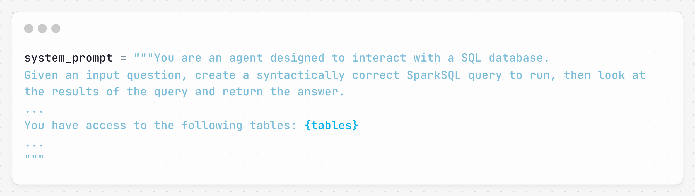

# [Road to Lakehouse - Part 3: Data Analytics with Generative AI](https://www.linkedin.com/pulse/road-lakehouse-part-3-data-analytics-generative-ai-tam-nguyen-jy8hc)

This is the third part of the Data Lakehouse series, focusing on data analysis with Generative AI. The source code for this project can be found in the repository linked below. For the pipeline architecture and implementation, refer to the previous parts:

- [Road to Lakehouse - Part 1: Delta Lake data pipeline overview](https://www.linkedin.com/pulse/road-lakehouse-part-1-delta-lake-data-pipeline-overview-tam-nguyen)
- [Road to Lakehouse - Part 2: Ingest and process data from Kafka with CDC](https://tam159.medium.com/road-to-lakehouse-part-2-ingest-and-process-data-from-kafka-with-cdc-and-delta-lakes-cdf-318708468a47)

## Introduction

After curating the data in the Lakehouse, we are now ready to analyze it and gain insights. With advancements in Generative AI, we can now leverage LLMs to generate SQL queries and answer analytical questions.

This article uses LangChain and LangGraph to build an agent to analyze data in Delta Lake format with Spark SQL, demonstrated by LangGraph Studio. The article also shares some techniques to boost agent accuracy, and discusses further improvements after the demo.

## Quick Start

1. Clone/fork this repo: [generative_ai](https://github.com/tam159/generative_ai)
2. Create a new file: `spark_ai/.env`, reference: `spark_ai/.env.example`
3. Download and run Docker.
4. Download [LangGraph Studio](https://github.com/langchain-ai/langgraph-studio)
5. In LangGraph Studio, open `generative_ai_/spark_ai` folder, it will use Docker to pull images and run containers for the agent.
6. (Optional) Star the above repo 🤗

## Data

### Data Source and Processing

I used fake Salesforce data from a forum. The raw data, in CSV format, is somewhat messy, with no explicit foreign keys. This simulates real-life challenges often encountered in the Lakehouse Bronze area, avoiding well-structured OLTP system sample data.

The data is transformed using Spark and stored in Delta Lake format. The Silver zone contains the following refined tables:

- **accounts**: company id, name, city, state
- **contacts**: company id, first and last name, country
- **leads**: first and last name, email, company name, status
- **opportunities**: name, company id, project, stage, close date, amount, currency

In production, it's advisable to query from the Gold layer or data marts. However, for this demo, the focus is on the Silver area to test how the LLM joins the tables without explicit references.

### Query Engine

For this demo, the agent uses Spark SQL to query the tables. The container has a standalone Spark cluster. In a production environment, computational resources are key to query performance, and a separate Spark/Trino/Presto cluster or cloud services like Amazon Athena, Azure Synapse Serverless SQL, or Databricks SQL Serverless should be considered.

## LangGraph Agent

The agent is built with LangChain and LangGraph, with its instruction provided in a system prompt. For the full prompt, refer to the `spark_prompt.py` file.

## Agent Tools

There are two groups of tools: **Safe Tools** (executed freely by the agent) and **Sensitive Tools** (require human approval).

### Safe Tools

- **list_tables_sql_db**: Outputs a comma-separated list of tables in Spark SQL.
- **schema_sql_db**: Outputs the schema and sample rows for specified tables.
- **query_checker_sql_db**: Double-checks SQL query correctness.
- **search_proper_company_name**: Looks up proper company names for filtering.

### Sensitive Tools

- **query_sql_db**: Executes SQL queries after human approval. This prevents large queries from over-consuming cluster resources or escalating cloud costs.

In production, SQL user permissions should be scoped as narrowly as possible. User-level quotas can be configured to limit resource usage.

## Agent Workflow

After defining all agent tools, nodes, and conditional edges, the agent workflow is constructed.

## Agent Techniques

### Human-in-the-Loop

Including a human-in-the-loop is beneficial when granting access to tools, allowing for manual approval before tool execution.

### High-Diversity Fields

For proper nouns like company names, it's important to verify spelling before using them in filters. A vector store of distinct proper nouns can be queried to ensure accuracy.

In the demo, only company names were embedded in FAISS, but in production, more nouns could be embedded in a persistent vector database like PostgreSQL or Qdrant.

### Dynamic Few-Shot Examples

Custom prompts tailored with domain-specific knowledge can enhance agent performance. A dynamic example selector helps construct prompts based on user input, providing more relevant examples for generating accurate queries.

## Agent Conversation

Sample conversation with LangGraph Studio and GPT-4o:

1. **"Show me total money of opportunities group by stage"**
   - The agent generates and refines a query.
   - 
   
2. **"How much can I earn if I acquire all leads from my accounts list?"**
   - The agent uses the schema_sql_db tool and query_checker_sql_db to ensure query correctness.
   - 

3. **"How many new leads exist in the accounts in Illinois state?"**
   - LLM corrects a typo and joins the tables based on column names.
   - 

4. **"Is there any working lead for Photo Bug company?"**
   - The agent uses the search_proper_company_name tool to find the correct company name.
   - 

## Further Improvements

### Relevant Subset of Tables

In production environments with many databases and tables, the system prompt should only include relevant tables for better efficiency.

### Table Partitioning, Clustering, and Sorting

Additional metadata about table partitioning, clustering, and sorting should be shared with the LLM to generate more optimized queries.

### Chain-of-Table

[Research](https://arxiv.org/pdf/2401.04398) on evolving tables through reasoning chains can further improve table understanding. This method could be explored in future articles.

### PlanRAG

The Plan-then-Retrieval Augmented Generation ([PlanRAG](https://aclanthology.org/2024.naacl-long.364.pdf)) framework, which includes planning and re-planning steps for LLMs, is another area to explore for improving decision-making processes.

## Conclusion

Data analysis is one of the use cases for Generative AI. This project demonstrates how LLMs can help analyze data in Delta Lake. In production, data governance, LLM evaluation, and operational aspects should be considered.

For more details, check out my article on [9 Methods to Enhance the Performance of an LLM RAG Application](#). Feel free to connect with me for further discussions on AI and LLM.
